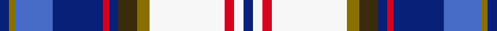

<nav class="crumbs crumbs-structural"><a href="/stripes/">Patterns</a> › <a href="/stripes/bgbbrbggwrwb/">BGBBRBGGWRWB</a></nav>
A tartan of the [Lashbrooke of Barrowfield](/families/lashbrooke-of-barrowfield/) family.
Its design is pattern [BGBBRBGGWRWB](/stripes/bgbbrbggwrwb/) — the page of every tartan sharing this colour sequence.

The **Lashbrooke of Barrowfield** tartan groups 2 setts — the same named design recorded as different cloths
(its kilt, Carpet, Child's…, or a transcription apart). The master sett (★) is the exemplar.

<table class="sett-table">
<thead><tr><th>Sett</th><th>ΔTartan</th><th>Thread count</th><th>Threads</th><th>Date</th></tr></thead>
<tbody>
<tr><td><a href="/variants/s12/db3y2t12db14r2db4dy6y4w24r2w2db3~x2~db1003265-t2105244/">Lashbrooke of Barrowfield</a> ★</td><td></td><td><code>DB/3 Y2 T12 DB14 R2 DB4 DY6 Y4 W24 R2 W2 DB/3</code></td><td>—</td><td>2013</td></tr>
<tr><td colspan="5" class="sett-swatch"></td></tr>
<tr><td><a href="/variants/s12/db3w3r3w24y4dy6db3r2db16b12y2db3~x2/">Lashbrooke of Barrowfield</a></td><td>0.16</td><td><code>DB/6 W6 R6 W48 Y8 DY12 DB6 R4 DB32 B24 Y4 DB/6</code></td><td>312</td><td>2013</td></tr>
<tr><td colspan="5" class="sett-swatch"></td></tr>
</tbody>
</table>

