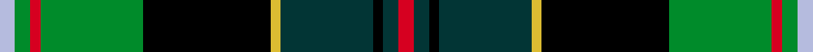

The **Loch Freuchie** tartan groups 3 setts — the same named design recorded as different cloths
(its kilt, Carpet, Child's…, or a transcription apart). The master sett (★) is the exemplar.

<table class="sett-table">
<thead><tr><th>Sett</th><th>Thread count</th><th>Variants</th></tr></thead>
<tbody>
<tr><td><a href="/setts/n3dg3r2dg20k25ly2ni13k2ni3r3/">Loch Freuchie</a> ★</td><td><code>R/6 Ni6 K4 Ni26 LY4 K50 DG40 R4 DG6 N/6</code></td><td>1</td></tr>
<tr><td colspan="3" class="sett-swatch"></td></tr>
<tr><td><a href="/setts/n3dg3r2dg20ki25k2ni13ki2ni3r3/">District Tartan</a></td><td><code>R/6 Ni6 Ki4 Ni26 K4 Ki50 DG40 R4 DG6 N/6</code></td><td>1</td></tr>
<tr><td colspan="3" class="sett-swatch"></td></tr>
<tr><td><a href="/setts/r3dt3k2dt18ly2k25g20r2g3lb3/">(District)</a></td><td><code>R/6 DT6 K4 DT36 LY4 K50 G40 R4 G6 LB/6</code></td><td>1</td></tr>
<tr><td colspan="3" class="sett-swatch"></td></tr>
</tbody>
</table>

