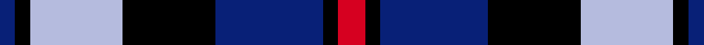

Its design is pattern [BKBKBKR](/stripes/bkbkbkr/) — the page of every tartan sharing this colour sequence.

Clan tartan for MacCorquodales, whose lands north of Loch Awe border Campbell territory near Inveraray.

The **MacCorquodale** tartan groups 2 setts — the same named design recorded as different cloths
(its kilt, Carpet, Child's…, or a transcription apart). The master sett (★) is the exemplar.

<table class="sett-table">
<thead><tr><th>Sett</th><th>Thread count</th><th>Threads</th><th>Date</th></tr></thead>
<tbody>
<tr><td><a href="/setts/r7k4t28k24ti24k4t4/">MacCorquodale</a> ★</td><td><code>R/14 K8 T56 K48 Ti48 K8 T/8</code></td><td>358</td><td>1981</td></tr>
<tr><td colspan="4" class="sett-swatch"></td></tr>
<tr><td><a href="/setts/r7k4db28k24lb24k4db4/">MacCorquodale</a></td><td><code>R/14 K8 DB56 K48 LB48 K8 DB/8</code></td><td>358</td><td>1981</td></tr>
<tr><td colspan="4" class="sett-swatch"></td></tr>
</tbody>
</table>

