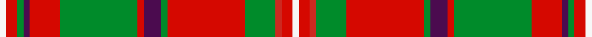

A tartan of [Clan MacKinnon](/clan/mackinnon/).
Its design is pattern [BRGBRGRBGRGBRW](/stripes/brgbrgrbgrgbrw/) — the page of every tartan sharing this colour sequence.

Clan tartan certified c.1816 by The Mackinnon for the Highland Society of London; stripe colours varied across later sources.

The **MacKinnon** tartan groups 4 setts — the same named design recorded as different cloths
(its kilt, Carpet, Child's…, or a transcription apart). The master sett (★) is the exemplar.

<table class="sett-table">
<thead><tr><th>Sett</th><th>Thread count</th><th>Threads</th><th>Date</th></tr></thead>
<tbody>
<tr><td><a href="/setts/dp2r3g2db2r6g16r2db4g2r16g8dp2r4w2/">MacKinnon</a> ★</td><td><code>DP/4 R6 G4 DB4 R12 G32 R4 DB8 G4 R32 G16 DP4 R8 W/4</code></td><td>276</td><td>1816</td></tr>
<tr><td colspan="4" class="sett-swatch"></td></tr>
<tr><td><a href="/setts/dr2r3g2db2r6g16r2db4g2r16g8dr2r4w2/">MacKinnon</a></td><td><code>DR/4 R6 G4 DB4 R12 G32 R4 DB8 G4 R32 G16 DR4 R8 W/4</code></td><td>138</td><td>—</td></tr>
<tr><td colspan="4" class="sett-swatch"></td></tr>
<tr><td colspan="4" class="sett-variants">2 Variants: <a href="/variants/s14/dr2r3g2db2r6g16r2db4g2r16g8dr2r4w2/">MacKinnon</a> · <a href="/variants/s14/dr2r3g2db2r6g16r2db4g2r16g8dr2r4w2~x2/">MacKinnon</a></td></tr>
<tr><td><a href="/setts/r1ri2g1k1ri5g11ri1k2g1ri11g4r1ri2w1/">#9</a></td><td><code>R/2 Ri4 G2 K2 Ri10 G22 Ri2 K4 G2 Ri22 G8 R2 Ri4 W/2</code></td><td>172</td><td>—</td></tr>
<tr><td colspan="4" class="sett-swatch"></td></tr>
<tr><td><a href="/setts/w3ri5r3g14ri36g3dp8ri3g36ri14dp3g3ri5w3/">#11</a></td><td><code>W/6 Ri10 G6 DP6 Ri28 G72 Ri6 DP16 G6 Ri72 G28 R6 Ri10 W/6</code></td><td>544</td><td>—</td></tr>
<tr><td colspan="4" class="sett-swatch"></td></tr>
</tbody>
</table>

## Also known as

This tartan is also recorded under:

- MacKinnon #11
- MacKinnon #8
- MacKinnon #9
- MacKinnon 4
- MacKinnon 5
