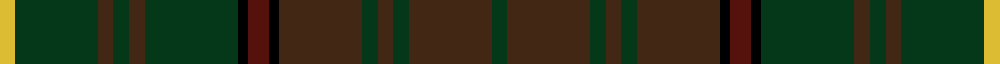

<nav class="crumbs crumbs-structural"><a href="/stripes/">Patterns</a> › <a href="/stripes/gbgbgbkbkgbgbgy/">GBGBGBKBKGBGBGY</a></nav>

A tartan of [Clan Ontario](/clan/ontario/).

Its design is pattern [GBGBGBKBKGBGBGY](/stripes/gbgbgbkbkgbgbgy/) — the page of every tartan sharing this colour sequence.

The **Ontario, Ensign of** tartan groups 3 setts — the same named design recorded as different cloths
(its kilt, Carpet, Child's…, or a transcription apart). The master sett (★) is the exemplar.

<table class="sett-table">
<thead><tr><th>Sett</th><th>ΔTartan</th><th>Thread count</th><th>Threads</th><th>Date</th></tr></thead>
<tbody>
<tr><td><a href="/variants/s15/ly4dg18do3dg3do3dg18k2dr4k2do16dg3do3dg3do16dg3~x2/">Ontario, Ensign of</a> ★</td><td></td><td><code>LY/8 DG36 DO6 DG6 DO6 DG36 K4 DR8 K4 DO32 DG6 DO6 DG6 DO32 DG/6</code></td><td>390</td><td>—</td></tr>
<tr><td colspan="5" class="sett-swatch"></td></tr>
<tr><td><a href="/variants/s15/dg3do16dg3do3dg3do16k2dr4k2dg18do3dg3do3dg16ly3~x2/">(District)</a></td><td>0.06</td><td><code>LY/6 DG32 DO6 DG6 DO6 DG36 K4 DR8 K4 DO32 DG6 DO6 DG6 DO32 DG/6</code></td><td>380</td><td>1965</td></tr>
<tr><td colspan="5" class="sett-swatch"></td></tr>
<tr><td><a href="/variants/s15/dg24k1r5k1do20dg4do4dg4do21dg4y5dg24do4dg4do4~x2/">Ontario Ensign of.. District Tartan</a></td><td>0.58</td><td><code>DG/48 K2 R10 K2 DO40 DG8 DO8 DG8 DO42 DG8 Y10 DG48 DO8 DG8 DO/8</code></td><td>460</td><td>1965</td></tr>
<tr><td colspan="5" class="sett-swatch"></td></tr>
</tbody>
</table>

## Also known as

This tartan is also recorded under:

- Ontario Ensign of..

## Nearest tartans

The nearest NAMED TARTANS — each represented by its master sett — by ΔTartan distance from this tartan's master, which leads the table so the swatches line up against it.

ΔTartan

Threads

Variant

Sett

—

390

<a href="/variants/s15/ly4dg18do3dg3do3dg18k2dr4k2do16dg3do3dg3do16dg3~x2/">Ontario, Ensign of</a>

<a href="/ttd/edit/#slug=g21k1r4k1o21g3o3g3o21g3y4g21o3g3o3~x2&amp;base=ly4dg18do3dg3do3dg18k2dr4k2do16dg3do3dg3do16dg3~x2" title="compare in the TTD">0.67</a>

412

<a href="/variants/s15/g21k1r4k1o21g3o3g3o21g3y4g21o3g3o3~x2/">Ensign, of Ontario</a>

<a href="/ttd/edit/#slug=dg21k1r4k1dy21dg3dy3dg3dy21dg3ly4dg21dy3dg3dy3~x2&amp;base=ly4dg18do3dg3do3dg18k2dr4k2do16dg3do3dg3do16dg3~x2" title="compare in the TTD">3.07</a>

412

<a href="/variants/s15/dg21k1r4k1dy21dg3dy3dg3dy21dg3ly4dg21dy3dg3dy3~x2/">Ensign of Ontario</a>

<a href="/ttd/edit/#slug=dg5db2dg12k4dg3dr3dg3dr13y3dr13dg3dr3dg3k3dg12db2dg5~x2&amp;base=ly4dg18do3dg3do3dg18k2dr4k2do16dg3do3dg3do16dg3~x2" title="compare in the TTD">3.47</a>

348

<a href="/variants/s17/dg5db2dg12k4dg3dr3dg3dr13y3dr13dg3dr3dg3k3dg12db2dg5~x2/">Lowland Donnelly</a>

<a href="/ttd/edit/#slug=dg18dr3dg3dr15dy13dr14dg3dr3dg18dy5dg2k5dg3dr2dg3db5dg2lg5~x2&amp;base=ly4dg18do3dg3do3dg18k2dr4k2do16dg3do3dg3do16dg3~x2" title="compare in the TTD">3.55</a>

442

<a href="/variants/s18/dg18dr3dg3dr15dy13dr14dg3dr3dg18dy5dg2k5dg3dr2dg3db5dg2lg5~x2/">Ben Murad</a>

<a href="/ttd/edit/#slug=k3g18do3g3do3g3do18dy3do3dy3do3dy12db2dy12do9dy12g2db2~x2&amp;base=ly4dg18do3dg3do3dg18k2dr4k2do16dg3do3dg3do16dg3~x2" title="compare in the TTD">3.66</a>

446

<a href="/variants/s18/k3g18do3g3do3g3do18dy3do3dy3do3dy12db2dy12do9dy12g2db2~x2/">Van Ingelgem Hunting</a>

## Neighbour map

Every grey dot is one of 10814 named tartans (their master setts) placed by the first two principal components of the ΔTartan feature space (42% of its variance). Red is this tartan; blue dots are its nearest — click one to open its master cloth. The map is a flat projection of a many-dimensional space — [how to read it](/posts/neighbourhood-maps/).

<svg viewBox="0 0 640 380" role="img" style="max-width:100%;height:auto;border:1px solid #e0e0e0;border-radius:4px;display:block" xmlns="http://www.w3.org/2000/svg"><image href="/nn/cloud-tartans.v1.png" width="640" height="380"/><a href="/variants/s15/g21k1r4k1o21g3o3g3o21g3y4g21o3g3o3~x2/"><circle cx="352.0" cy="159.6" r="4" fill="#3465a4"><title>Ensign, of Ontario</title></circle></a><a href="/variants/s15/dg21k1r4k1dy21dg3dy3dg3dy21dg3ly4dg21dy3dg3dy3~x2/"><circle cx="400.5" cy="180.7" r="4" fill="#3465a4"><title>Ensign of Ontario</title></circle></a><a href="/variants/s17/dg5db2dg12k4dg3dr3dg3dr13y3dr13dg3dr3dg3k3dg12db2dg5~x2/"><circle cx="313.6" cy="224.5" r="4" fill="#3465a4"><title>Lowland Donnelly</title></circle></a><a href="/variants/s18/dg18dr3dg3dr15dy13dr14dg3dr3dg18dy5dg2k5dg3dr2dg3db5dg2lg5~x2/"><circle cx="250.7" cy="193.0" r="4" fill="#3465a4"><title>Ben Murad</title></circle></a><a href="/variants/s18/k3g18do3g3do3g3do18dy3do3dy3do3dy12db2dy12do9dy12g2db2~x2/"><circle cx="247.5" cy="204.4" r="4" fill="#3465a4"><title>Van Ingelgem Hunting</title></circle></a><circle cx="354.9" cy="218.1" r="5" fill="#c00000"/><text x="320" y="376" text-anchor="middle" font-size="11" fill="#999">ground</text><text x="11" y="190" text-anchor="middle" font-size="11" fill="#999" transform="rotate(-90 11 190)">complexity</text></svg>
