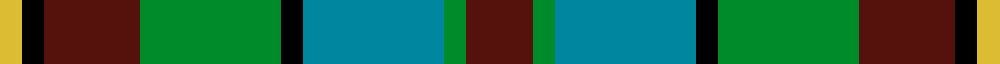

Its design is pattern [BGBKGBKB](/stripes/bgbkgbkb/) — the page of every tartan sharing this colour sequence.

The **Orkney** tartan groups 2 setts — the same named design recorded as different cloths
(its kilt, Carpet, Child's…, or a transcription apart). The master sett (★) is the exemplar.

<table class="sett-table">
<thead><tr><th>Sett</th><th>Thread count</th><th>Threads</th><th>Date</th></tr></thead>
<tbody>
<tr><td><a href="/setts/dr6dg2db12k2dg12dr9k2b2/">Orkney</a> ★</td><td><code>DR/12 DG4 DB24 K4 DG24 DR18 K4 B/4</code></td><td>172</td><td>—</td></tr>
<tr><td colspan="4" class="sett-swatch"></td></tr>
<tr><td><a href="/setts/dr9g3t19k3g19dr13k3ly3/">(District?)</a></td><td><code>DR/18 G6 T38 K6 G38 DR26 K6 LY/6</code></td><td>264</td><td>2000</td></tr>
<tr><td colspan="4" class="sett-swatch"></td></tr>
</tbody>
</table>

