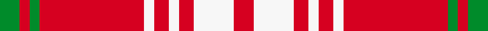

Named for Queen Alexandra, with colours drawn from the Provincial Coat of Arms; unregistered with Lord Lyon.

The **Queen Alexandra** tartan groups 2 setts — the same named design recorded as different cloths
(its kilt, Carpet, Child's…, or a transcription apart). The master sett (★) is the exemplar.

<table class="sett-table">
<thead><tr><th>Sett</th><th>Thread count</th><th>Variants</th></tr></thead>
<tbody>
<tr><td><a href="/setts/dg4r2dg2r16lr2r3lr2r3lr8r3/">Queen Alexandra</a> ★</td><td><code>DG/8 R4 DG4 R32 LR4 R6 LR4 R6 LR16 R/6</code></td><td>2</td></tr>
<tr><td colspan="3" class="sett-swatch"></td></tr>
<tr><td><a href="/setts/r4w8r3w2r3w2r21g2r2g4/">Queen Alexandra</a></td><td><code>R/8 W16 R6 W4 R6 W4 R42 G4 R4 G/8</code></td><td>1</td></tr>
<tr><td colspan="3" class="sett-swatch"></td></tr>
</tbody>
</table>

