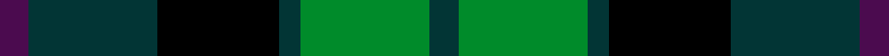

Corporate design for Scottish Airports, based on the Gunn sett in British Airports Authority colours with a purple thistle line.

The **Scottish Airports** tartan groups 3 setts — the same named design recorded as different cloths
(its kilt, Carpet, Child's…, or a transcription apart). The master sett (★) is the exemplar.

<table class="sett-table">
<thead><tr><th>Sett</th><th>Thread count</th><th>Variants</th></tr></thead>
<tbody>
<tr><td><a href="/setts/dp4n18k17n3g18n4/">Scottish Airports</a> ★</td><td><code>N/8 G36 N6 K34 N36 DP/8</code></td><td>2</td></tr>
<tr><td colspan="3" class="sett-swatch"></td></tr>
<tr><td><a href="/setts/db18k17db3g18db4g18db3k17db18p4/">Corporate Tartan</a></td><td><code>DB/36 K34 DB6 G36 DB8 G36 DB6 K34 DB36 P/8</code></td><td>1</td></tr>
<tr><td colspan="3" class="sett-swatch"></td></tr>
<tr><td><a href="/setts/dt4g18dt3k17dt18dp4/">Scottish Airports</a></td><td><code>DT/8 G36 DT6 K34 DT36 DP/8</code></td><td>1</td></tr>
<tr><td colspan="3" class="sett-swatch"></td></tr>
</tbody>
</table>

