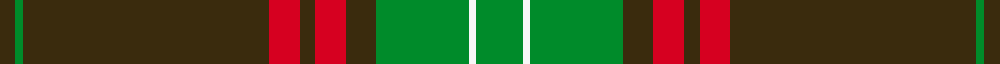

Its design is pattern [GGGRGRGGWGWGGRGRGG](/stripes/gggrgrggwgwggrgrgg/) — the page of every tartan sharing this colour sequence.

Hunting variant of the Seton family tartan, derived from the Vestiarium Scoticum.

The **Seton Hunting** tartan groups 2 setts — the same named design recorded as different cloths
(its kilt, Carpet, Child's…, or a transcription apart). The master sett (★) is the exemplar.

<table class="sett-table">
<thead><tr><th>Sett</th><th>Thread count</th><th>Threads</th><th>Date</th></tr></thead>
<tbody>
<tr><td><a href="/setts/dy3g1dy15r2dy1r2dy1g7w1g2/">Seton Hunting</a> ★</td><td><code>DY/12 G4 DY60 R8 DY4 R8 DY4 G28 W4 G8 W4 G28 DY4 R8 DY4 R8 DY60 G/4</code></td><td>260</td><td>1930</td></tr>
<tr><td colspan="4" class="sett-swatch"></td></tr>
<tr><td colspan="4" class="sett-variants">2 Variants: <a href="/variants/s10/dy3g1dy15r2dy1r2dy1g7w1g2~x4/">Seton Htg (Clan)</a> · <a href="/variants/s10/dy3g1dy15r2dy1r2dy1g7w1g2~x4~g2203152/">Seton Hunting</a></td></tr>
<tr><td><a href="/setts/g6w1g12dy4r4dy2r4dy32g1dy2/">Family Tartan</a></td><td><code>G/12 W2 G24 DY8 R8 DY4 R8 DY64 G2 DY/4</code></td><td>256</td><td>~1930</td></tr>
<tr><td colspan="4" class="sett-swatch"></td></tr>
</tbody>
</table>

## Also known as

This tartan is also recorded under:

- Seton Htg
