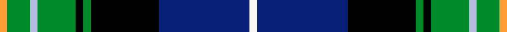

Designed by the club's Secretary and Chairman with House of Tartan; colours from the club crest.

The **St Andrews Golf Club** tartan groups 2 setts — the same named design recorded as different cloths
(its kilt, Carpet, Child's…, or a transcription apart). The master sett (★) is the exemplar.

<table class="sett-table">
<thead><tr><th>Sett</th><th>Thread count</th><th>Variants</th></tr></thead>
<tbody>
<tr><td><a href="/setts/r1dg3t1dg5k1dg1k9db12w1/">St Andrews Golf Club</a> ★</td><td><code>R/4 DG12 T4 DG20 K4 DG4 K36 DB48 W/4</code></td><td>1</td></tr>
<tr><td colspan="3" class="sett-swatch"></td></tr>
<tr><td><a href="/setts/w1db12k9g1k1g5lb1g3lo1/">St. Andrews Golf Club (Corporate)</a></td><td><code>LO/4 G12 LB4 G20 K4 G4 K36 DB48 W/4</code></td><td>1</td></tr>
<tr><td colspan="3" class="sett-swatch"></td></tr>
</tbody>
</table>

## Also known as

This tartan is also recorded under:

- St. Andrews Golf Club
