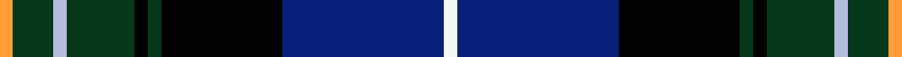

Its design is pattern [RGBGKGKBW](/stripes/rgbgkgkbw/) — the page of every tartan sharing this colour sequence.

Designed by the club's Secretary and Chairman with House of Tartan; colours from the club crest.

The **St Andrews Golf Club** tartan groups 2 setts — the same named design recorded as different cloths
(its kilt, Carpet, Child's…, or a transcription apart). The master sett (★) is the exemplar.

<table class="sett-table">
<thead><tr><th>Sett</th><th>Thread count</th><th>Threads</th><th>Date</th></tr></thead>
<tbody>
<tr><td><a href="/setts/r1g3t1g5k1g1k9db12w1/">St Andrews Golf Club</a> ★</td><td><code>R/4 G12 T4 G20 K4 G4 K36 DB48 W/4</code></td><td>264</td><td>2011</td></tr>
<tr><td colspan="4" class="sett-swatch"></td></tr>
<tr><td><a href="/setts/w1db12k9dg1k1dg5lb1dg3lo1/">St. Andrews Golf Club (Corporate)</a></td><td><code>LO/4 DG12 LB4 DG20 K4 DG4 K36 DB48 W/4</code></td><td>264</td><td>2011</td></tr>
<tr><td colspan="4" class="sett-swatch"></td></tr>
</tbody>
</table>

## Also known as

This tartan is also recorded under:

- St. Andrews Golf Club
