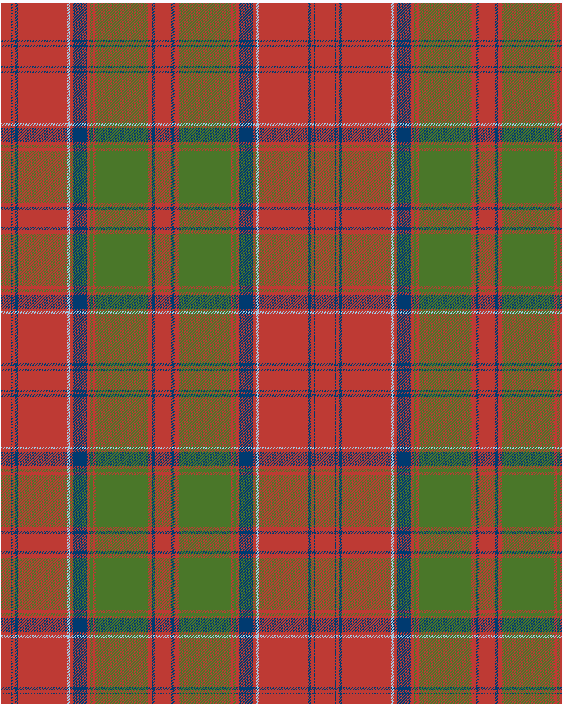

Drummond 2022 Kilt

This was sourced from <no value>.  It is a 15 stripes tartan.

Original link https://tartandictionary.org/posts/drummondsofmegginchproposal//

## Thread count
R/14 DB2 R4 DB4 R70 LB4 R4 DB20 R4 G4 R4 G74 R6 DB4 R/12

## Palette
DB#003a70 G#4a7729 LB#a4c8e1 R#be3a34

# Sample pattern

ID: b40c9f59-f201-499f-848b-d64f7768163d