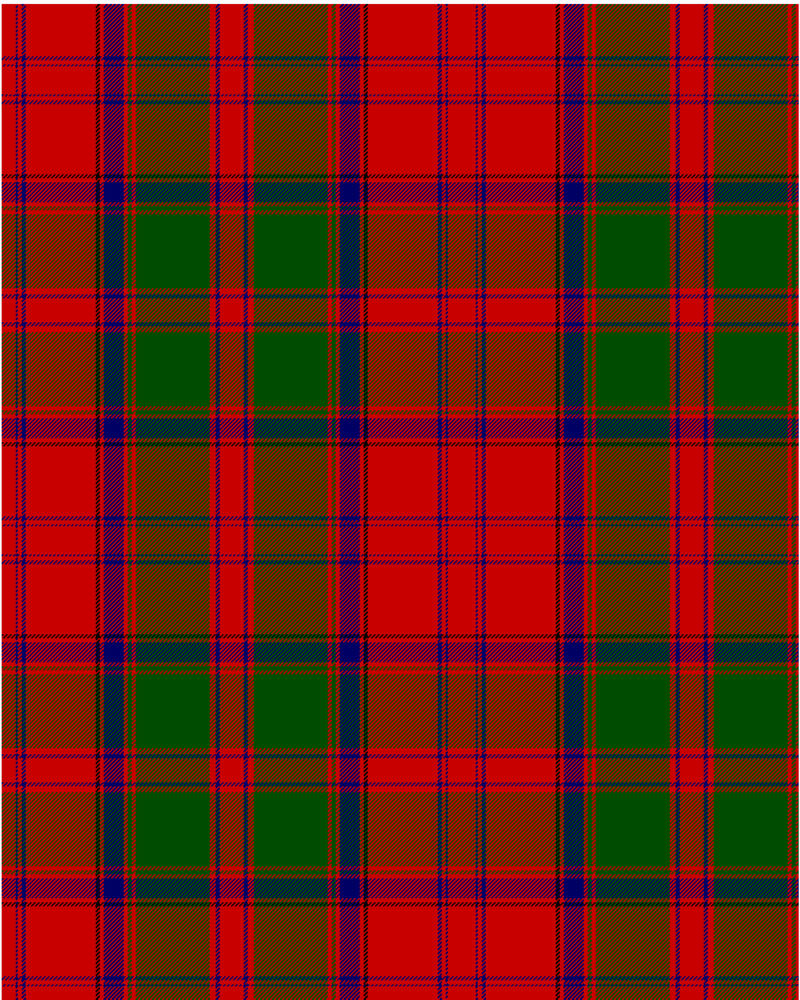

Drummond 1849 Kilt

This was sourced from <no value>.  It is a 15 stripes tartan.

Original link https://tartandictionary.org/posts/drummondsofmeggincholdkilt/

## Thread count
R/14 DB2 R4 DB4 R70 LB4 R4 DB20 R4 G4 R4 G74 R6 DB4 R/12

## Palette
DB#000064 G#004c00 LB#000000 R#c80000

# Sample pattern

ID: c7909966-5cc8-48e3-bb5b-2ebf9d08bb5f