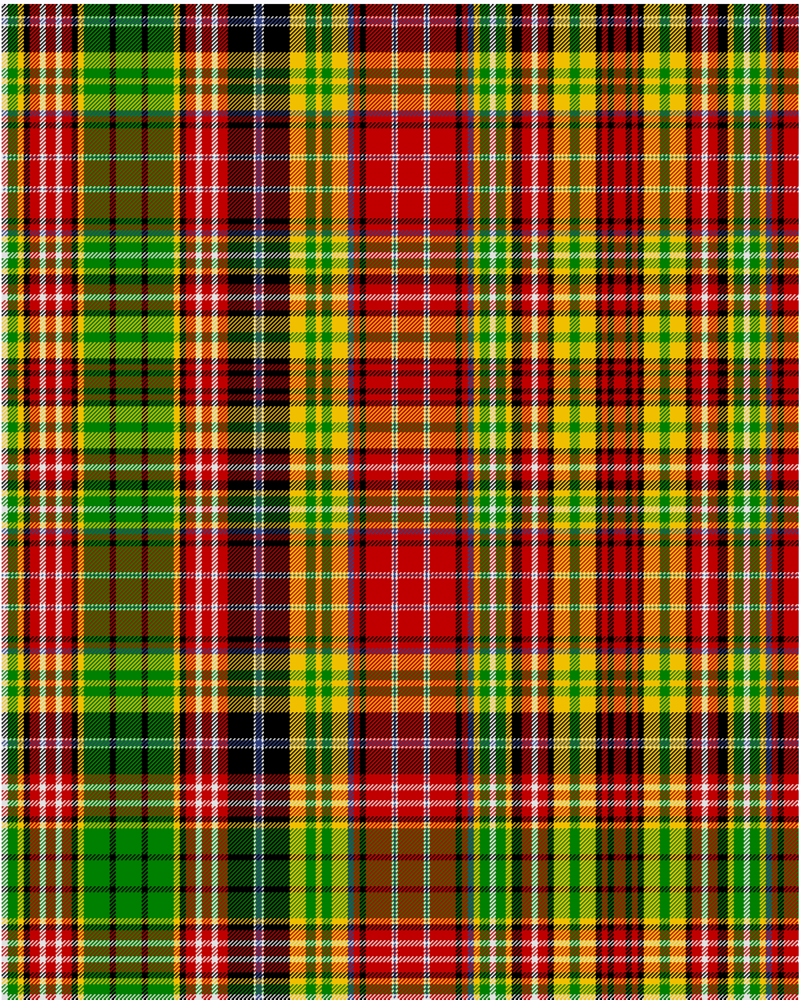

Drummond of Strathallan

This was sourced from <no value>.  It is a 65 stripes tartan.

Original link http://www.weddslist.com/cgi-bin/tartans/pg.pl?source=sts

## Thread count
W/6 G10 Y6 K6 R10 W6 R10 W6 R10 K6 Y6 G26 K6 G26 K6 G26 Y6 K6 R10 W6 R10 W6 R10 K26 W2 B6 W2 K26 Y16 G10 Y6 G10 Y16 B6 R6 K6 R26 W2 B2 W2 R26 W2 B2 W2 R26 K6 R6 B6 Y6 G10 W6 G10 Y6 K10 R10 W6 R10 K6 Y16 G10 Y16 K6 R6 K6 R/6

## Palette
B#304080 G#008000 K#000000 R#c00000 W#e0e0e0 Y#f0c000

# Sample pattern

ID: 4294b84f-7113-4cb5-a105-6f6fca85ac4c