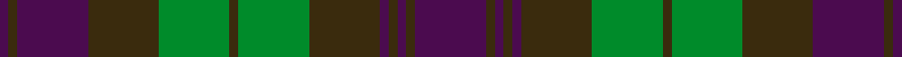

Its design is pattern [BGBGBGGGGGBGB](/stripes/bgbgbgggggbgb/) — the page of every tartan sharing this colour sequence.

The **Tyneside Scottish** tartan groups 3 setts — the same named design recorded as different cloths
(its kilt, Carpet, Child's…, or a transcription apart). The master sett (★) is the exemplar.

<table class="sett-table">
<thead><tr><th>Sett</th><th>Thread count</th><th>Threads</th><th>Date</th></tr></thead>
<tbody>
<tr><td><a href="/setts/t8dy1t1dy1t1dy8g8dy1g8dy8t8dy1t1/">Tyneside Scottish</a> ★</td><td><code>T/48 DY6 T6 DY6 T6 DY48 G48 DY6 G48 DY48 T48 DY6 T/6</code></td><td>606</td><td>1914</td></tr>
<tr><td colspan="4" class="sett-swatch"></td></tr>
<tr><td><a href="/setts/db8dy1db1dy1db1dy8g8dy1g8dy8db8dy1db1/">(Blue) (District)</a></td><td><code>DB/48 DY6 DB6 DY6 DB6 DY48 G48 DY6 G48 DY48 DB48 DY6 DB/6</code></td><td>606</td><td>~1914</td></tr>
<tr><td colspan="4" class="sett-swatch"></td></tr>
<tr><td><a href="/setts/dp8dy1dp1dy1dp1dy8g8dy1g8dy8dp8dy1dp1/">Purple (Mil/Distr)</a></td><td><code>DP/48 DY6 DP6 DY6 DP6 DY48 G48 DY6 G48 DY48 DP48 DY6 DP/6</code></td><td>606</td><td>~1917</td></tr>
<tr><td colspan="4" class="sett-swatch"></td></tr>
</tbody>
</table>

## Also known as

This tartan is also recorded under:

- Tyneside Scottish Purple
