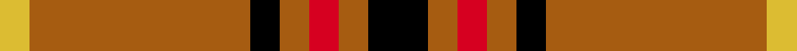

Created by a 1967 Cardiff society to assert Welsh nationhood; colours from the Welsh flag, design echoing MacDonald.

The **Welsh National** tartan groups 6 setts — the same named design recorded as different cloths
(its kilt, Carpet, Child's…, or a transcription apart). The master sett (★) is the exemplar.

<table class="sett-table">
<thead><tr><th>Sett</th><th>Thread count</th><th>Variants</th></tr></thead>
<tbody>
<tr><td><a href="/setts/k4dy2r2dy2k2dy15lo2/">Welsh National</a> ★</td><td><code>K/16 DY8 R8 DY8 K8 DY60 LO8 DY60 K8 DY8 R8 DY/8</code></td><td>2</td></tr>
<tr><td colspan="3" class="sett-swatch"></td></tr>
<tr><td><a href="/setts/k4o2r2o2k2o15ly2/">Welsh, National</a></td><td><code>K/16 O8 R8 O8 K8 O60 LY/8</code></td><td>1</td></tr>
<tr><td colspan="3" class="sett-swatch"></td></tr>
<tr><td><a href="/setts/ly7k4ly4k39r4/">#3</a></td><td><code>LY/14 K8 LY8 K78 R/8</code></td><td>1</td></tr>
<tr><td colspan="3" class="sett-swatch"></td></tr>
<tr><td><a href="/setts/m2g1m1g10w1/">District Tartan</a></td><td><code>M/8 G4 M4 G40 W/4</code></td><td>1</td></tr>
<tr><td colspan="3" class="sett-swatch"></td></tr>
<tr><td><a href="/setts/r2g1r1g11w1/">Welsh, National</a></td><td><code>R/16 G8 R8 G88 W/8</code></td><td>1</td></tr>
<tr><td colspan="3" class="sett-swatch"></td></tr>
<tr><td><a href="/setts/r8g3r4g44w4/">Welsh National</a></td><td><code>R/16 G6 R8 G88 W8 G88 R8 G/6</code></td><td>2</td></tr>
<tr><td colspan="3" class="sett-swatch"></td></tr>
</tbody>
</table>

## Also known as

This tartan is also recorded under:

- Welsh National #2
- Welsh National #3
- Welsh, National
