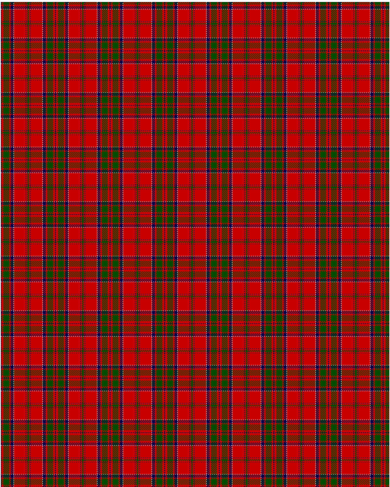

MacDonell of Keppoch

This was sourced from <no value>.  It is a 10 stripes tartan.

Original link http://www.weddslist.com/cgi-bin/tartans/pg.pl?source=rb

## Thread count
DB/1 R4 G12 R3 DB6 N1 R24 DB1 R2 G/2

## Palette
DB#00004C G#004C00 N#D0D0D0 R#C80000

# Sample pattern

ID: DB/1/R4/G12/R3/DB6/N1/R24/DB1/R2/G/2-DB$00004C G$004C00 N$D0D0D0 R$C80000