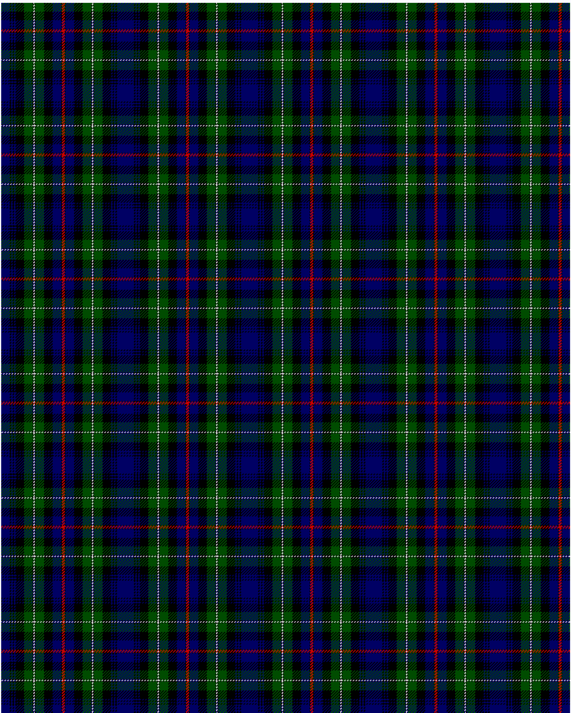

MacKenzie

This was sourced from <no value>.  It is a 15 stripes tartan.

Original link http://www.weddslist.com/cgi-bin/tartans/pg.pl?source=rb

## Thread count
DB/12 K2 DB2 K2 DB2 K12 G12 K1 N2 K1 G12 K12 DB12 K1 R/2

## Palette
DB#000064 G#004C00 K#000000 N#D0D0D0 R#C80000

# Sample pattern

ID: DB/12/K2/DB2/K2/DB2/K12/G12/K1/N2/K1/G12/K12/DB12/K1/R/2-DB$000064 G$004C00 K$000000 N$D0D0D0 R$C80000