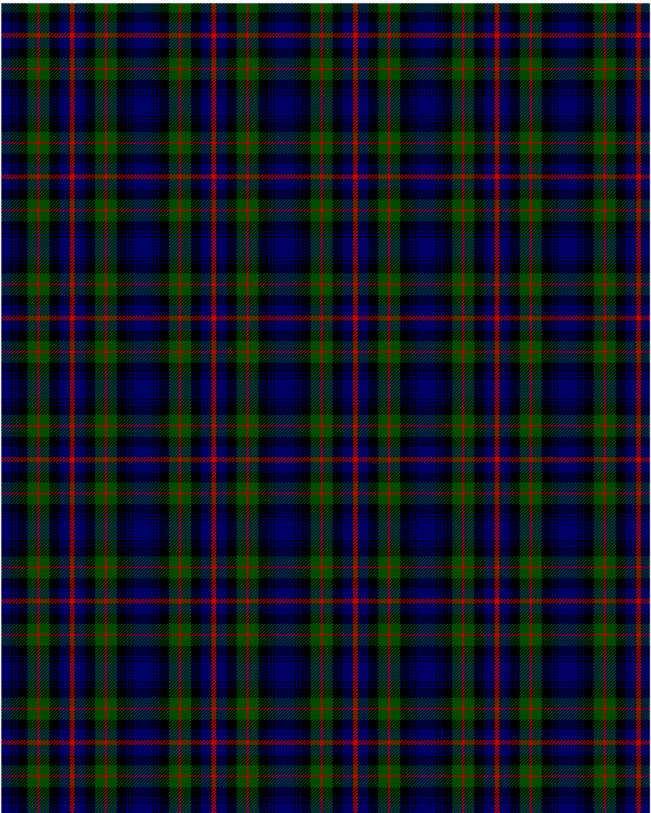

Murray of Atholl

This was sourced from <no value>.  It is a 13 stripes tartan.

Original link http://www.weddslist.com/cgi-bin/tartans/pg.pl?source=rb

## Thread count
DB/12 K2 DB2 K2 DB2 K12 G12 R3 G12 K12 DB12 K1 R/3

## Palette
DB#000064 G#004C00 K#000000 R#C80000

# Sample pattern

ID: DB/12/K2/DB2/K2/DB2/K12/G12/R3/G12/K12/DB12/K1/R/3-DB$000064 G$004C00 K$000000 R$C80000