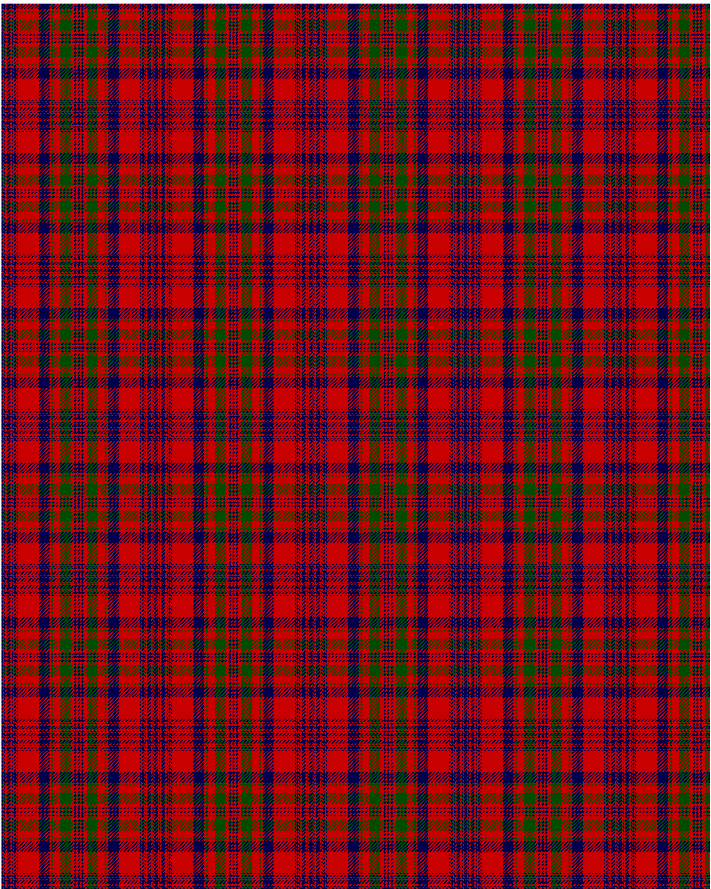

Murray of Tullibardine

This was sourced from <no value>.  It is a 21 stripes tartan.

Original link http://www.weddslist.com/cgi-bin/tartans/pg.pl?source=rb

## Thread count
DB/2 R1 DB1 R2 DB4 R2 DB1 R1 DB2 R1 DB1 R24 DB12 R2 G2 R8 G12 R4 DB2 R2 DB/1

## Palette
DB#00004C G#004C00 R#C80000

# Sample pattern

ID: DB/2/R1/DB1/R2/DB4/R2/DB1/R1/DB2/R1/DB1/R24/DB12/R2/G2/R8/G12/R4/DB2/R2/DB/1-DB$00004C G$004C00 R$C80000