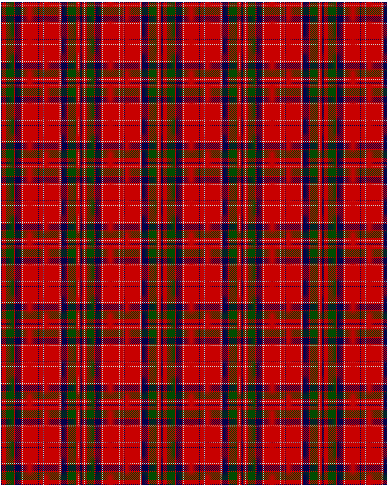

MacGillivray

This was sourced from <no value>.  It is a 13 stripes tartan.

Original link http://www.weddslist.com/cgi-bin/tartans/pg.pl?source=rb

## Thread count
DB/2 R4 N1 R4 G16 R2 DB12 R2 N2 R32 DB1 N1 R/4

## Palette
DB#00004C G#004C00 N#D0D0D0 R#C80000

# Sample pattern

ID: DB/2/R4/N1/R4/G16/R2/DB12/R2/N2/R32/DB1/N1/R/4-DB$00004C G$004C00 N$D0D0D0 R$C80000