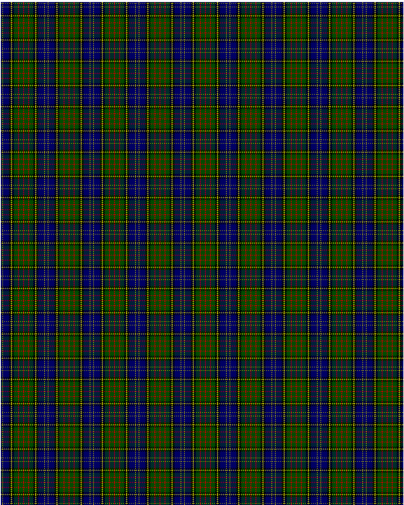

MacMillan Hunting

This was sourced from <no value>.  It is a 10 stripes tartan.

Original link http://www.weddslist.com/cgi-bin/tartans/pg.pl?source=rb

## Thread count
DB/3 Y1 DB12 K4 Y2 K4 G8 R2 G8 R/1

## Palette
DB#000064 G#004C00 K#000000 R#C80000 Y#C8C800

# Sample pattern

ID: DB/3/Y1/DB12/K4/Y2/K4/G8/R2/G8/R/1-DB$000064 G$004C00 K$000000 R$C80000 Y$C8C800