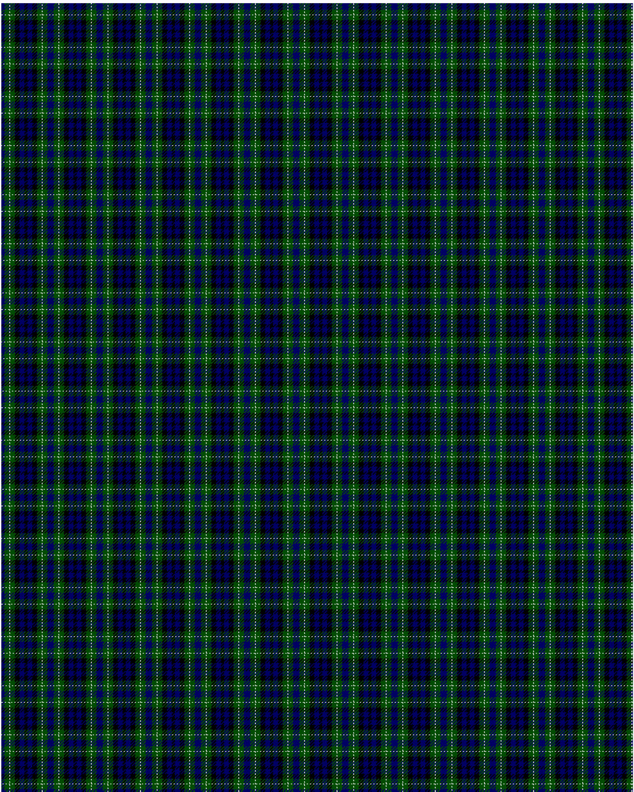

MacNeil of Colonsay

This was sourced from <no value>.  It is a 7 stripes tartan.

Original link http://www.weddslist.com/cgi-bin/tartans/pg.pl?source=rb

## Thread count
DB/4 G6 N1 G6 K6 DB6 K/2

## Palette
DB#000064 G#004C00 K#000000 N#D0D0D0

# Sample pattern

ID: DB/4/G6/N1/G6/K6/DB6/K/2-DB$000064 G$004C00 K$000000 N$D0D0D0