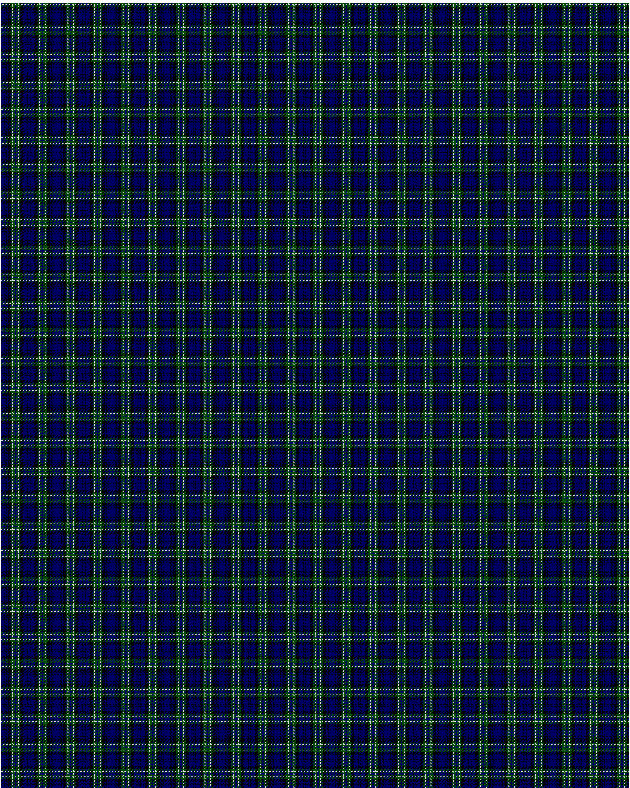

Arbuthnott

This was sourced from <no value>.  It is a 17 stripes tartan.

Original link http://www.weddslist.com/cgi-bin/tartans/pg.pl?source=rb

## Thread count
DB/4 K1 DB1 K1 DB1 K4 G2 N1 G2 DB2 G2 N1 G2 K4 DB5 K1 DB/1

## Palette
DB#000064 G#004C00 K#000000 N#D0D0D0

# Sample pattern

ID: DB/4/K1/DB1/K1/DB1/K4/G2/N1/G2/DB2/G2/N1/G2/K4/DB5/K1/DB/1-DB$000064 G$004C00 K$000000 N$D0D0D0