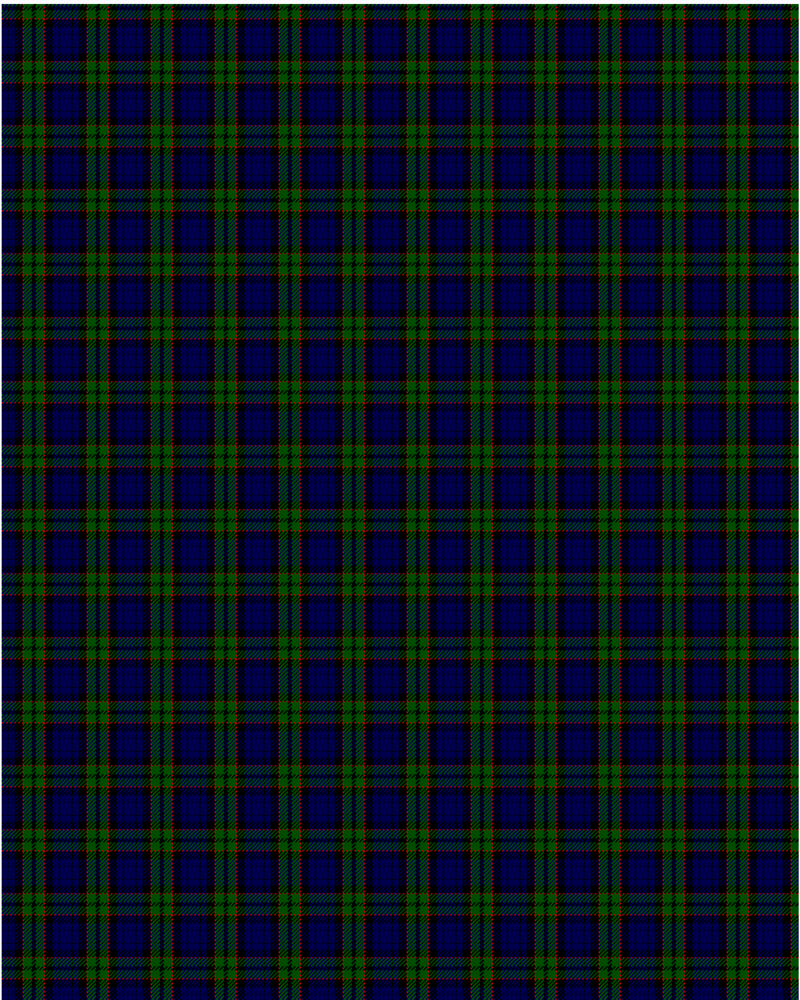

Fletcher

This was sourced from <no value>.  It is a 7 stripes tartan.

Original link http://www.weddslist.com/cgi-bin/tartans/pg.pl?source=rb

## Thread count
DB/6 K1 DB6 K8 R1 G8 K/2

## Palette
DB#00004C G#004C00 K#000000 R#C80000

# Sample pattern

ID: DB/6/K1/DB6/K8/R1/G8/K/2-DB$00004C G$004C00 K$000000 R$C80000