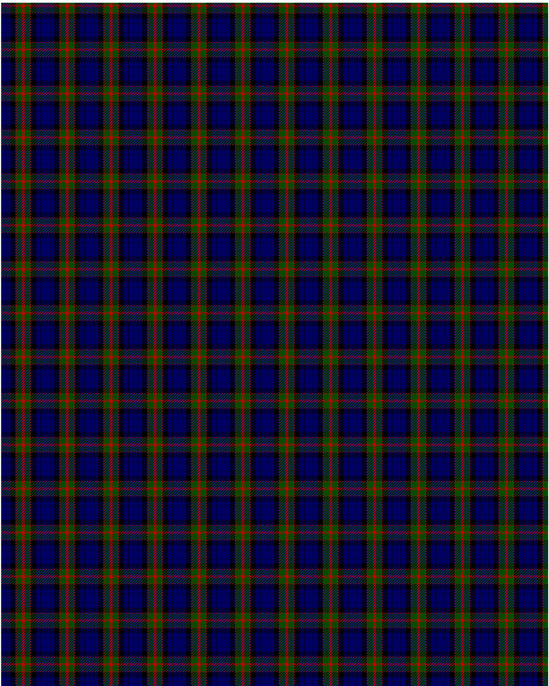

Fletcher C

This was sourced from <no value>.  It is a 7 stripes tartan.

Original link http://www.weddslist.com/cgi-bin/tartans/pg.pl?source=rb

## Thread count
DB/6 K1 DB6 K8 R1 G8 R/2

## Palette
DB#000064 G#004C00 K#000000 R#C80000

# Sample pattern

ID: DB/6/K1/DB6/K8/R1/G8/R/2-DB$000064 G$004C00 K$000000 R$C80000