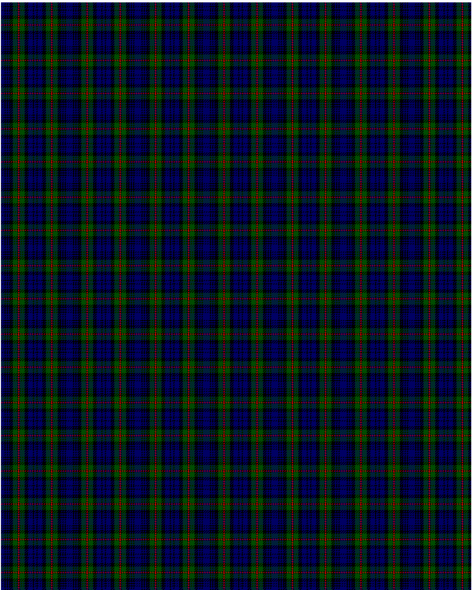

MacKinlay

This was sourced from <no value>.  It is a 15 stripes tartan.

Original link http://www.weddslist.com/cgi-bin/tartans/pg.pl?source=rb

## Thread count
DB/6 K2 DB2 K2 DB2 K6 G8 K1 R2 K1 G8 K6 DB8 K2 DB/2

## Palette
DB#000064 G#004C00 K#000000 R#C80000

# Sample pattern

ID: DB/6/K2/DB2/K2/DB2/K6/G8/K1/R2/K1/G8/K6/DB8/K2/DB/2-DB$000064 G$004C00 K$000000 R$C80000