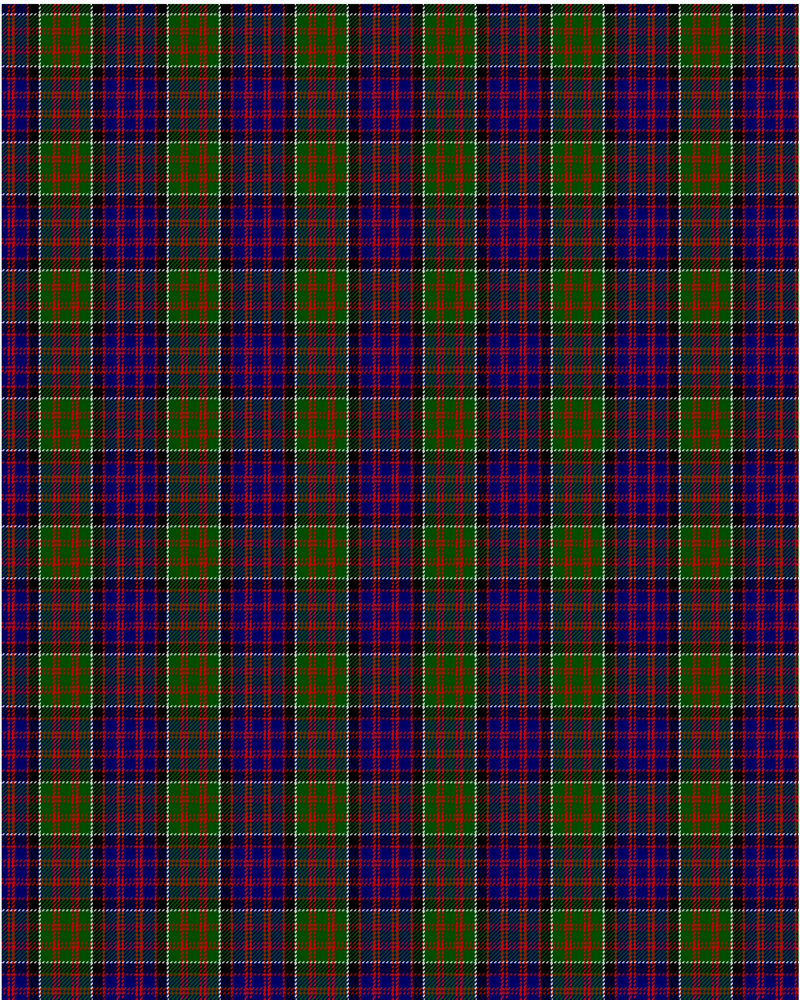

MacDonald of Clanranald D

This was sourced from <no value>.  It is a 13 stripes tartan.

Original link http://www.weddslist.com/cgi-bin/tartans/pg.pl?source=rb

## Thread count
DB/6 R2 DB2 R3 DB12 R2 K10 N2 G12 R3 G2 R2 G/6

## Palette
DB#000064 G#004C00 K#000000 N#D0D0D0 R#C80000

# Sample pattern

ID: DB/6/R2/DB2/R3/DB12/R2/K10/N2/G12/R3/G2/R2/G/6-DB$000064 G$004C00 K$000000 N$D0D0D0 R$C80000