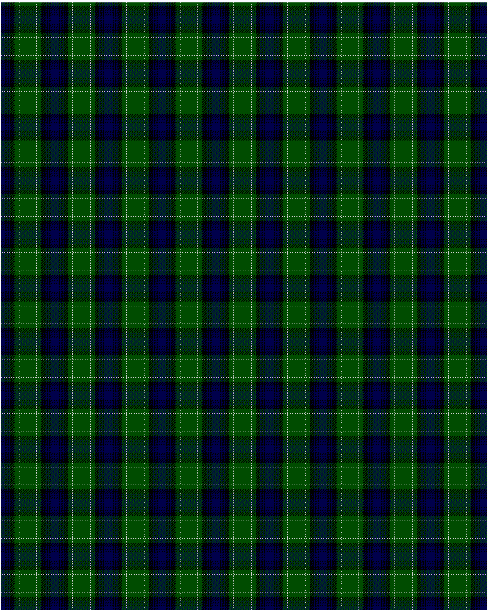

Abercrombie

This was sourced from <no value>.  It is a 9 stripes tartan.

Original link http://www.weddslist.com/cgi-bin/tartans/pg.pl?source=rb

## Thread count
DB/7 K2 DB2 K2 DB2 K7 G7 N1 G/14

## Palette
DB#00004C G#004C00 K#000000 N#D0D0D0

# Sample pattern

ID: DB/7/K2/DB2/K2/DB2/K7/G7/N1/G/14-DB$00004C G$004C00 K$000000 N$D0D0D0