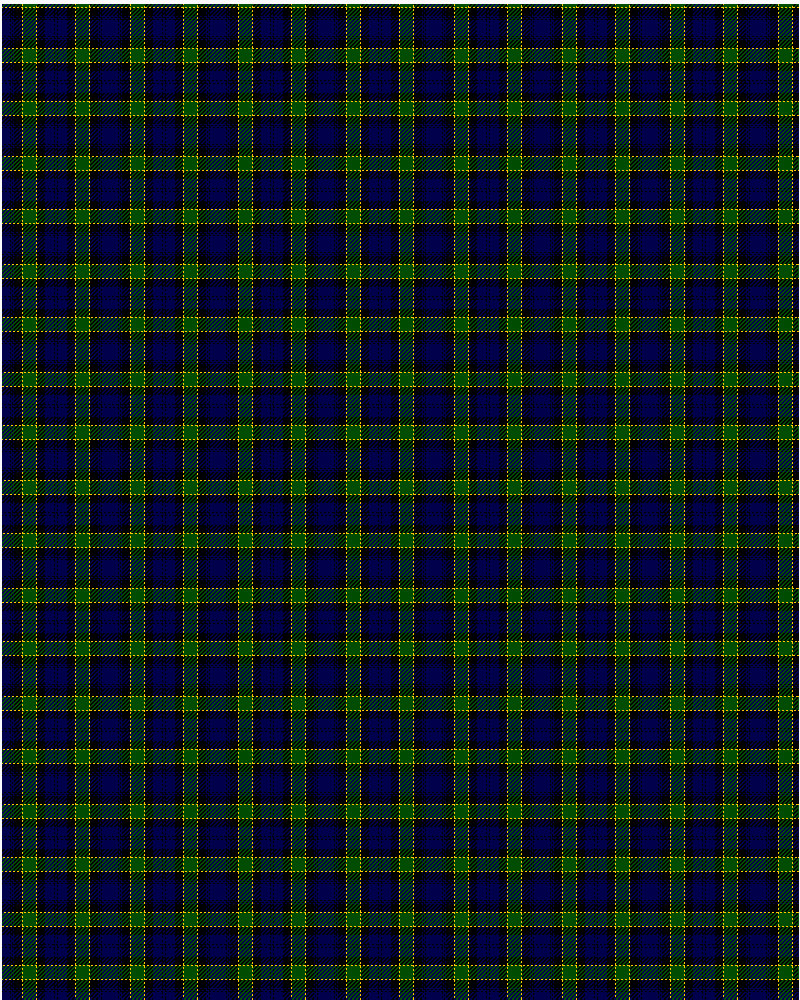

Breadalbane Fencibles

This was sourced from <no value>.  It is a 13 stripes tartan.

Original link http://www.weddslist.com/cgi-bin/tartans/pg.pl?source=rb

## Thread count
DB/8 K1 DB1 K1 DB1 K8 Y1 G13 Y1 K8 DB9 K1 DB/1

## Palette
DB#00004C G#004C00 K#000000 Y#FFC800

# Sample pattern

ID: DB/8/K1/DB1/K1/DB1/K8/Y1/G13/Y1/K8/DB9/K1/DB/1-DB$00004C G$004C00 K$000000 Y$FFC800