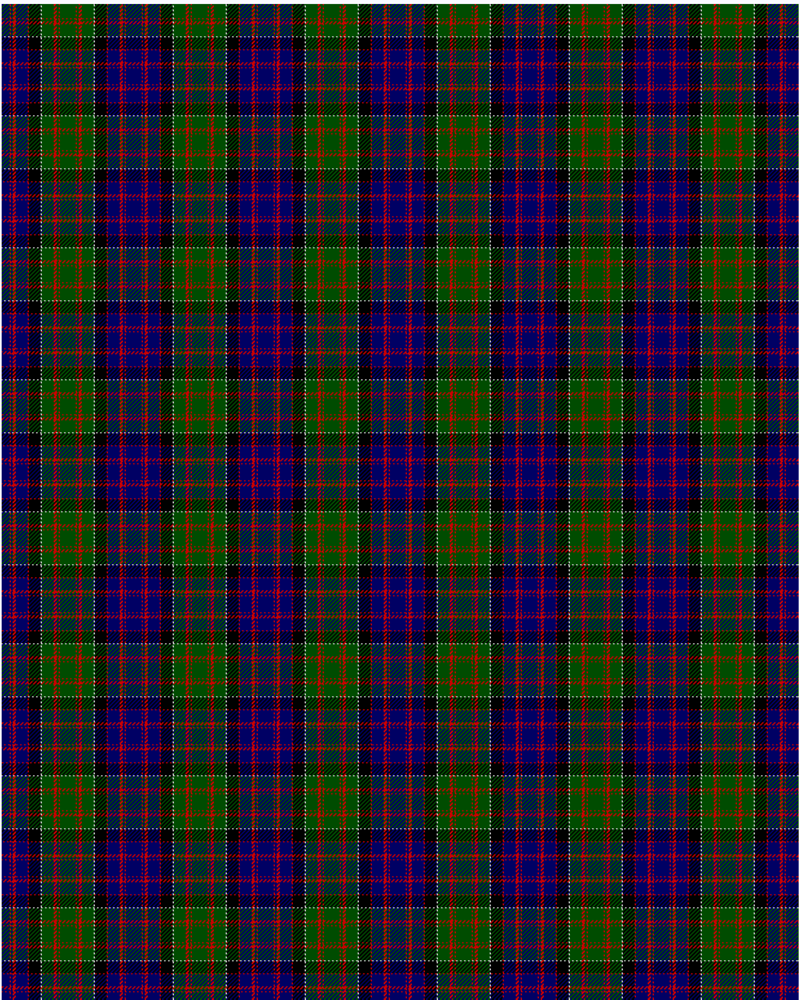

MacDonald of Clanranald

This was sourced from <no value>.  It is a 13 stripes tartan.

Original link http://www.weddslist.com/cgi-bin/tartans/pg.pl?source=rb

## Thread count
DB/8 R1 DB2 R3 DB12 R1 K12 N1 G12 R3 G2 R1 G/8

## Palette
DB#000064 G#004C00 K#000000 N#D0D0D0 R#C80000

# Sample pattern

ID: DB/8/R1/DB2/R3/DB12/R1/K12/N1/G12/R3/G2/R1/G/8-DB$000064 G$004C00 K$000000 N$D0D0D0 R$C80000