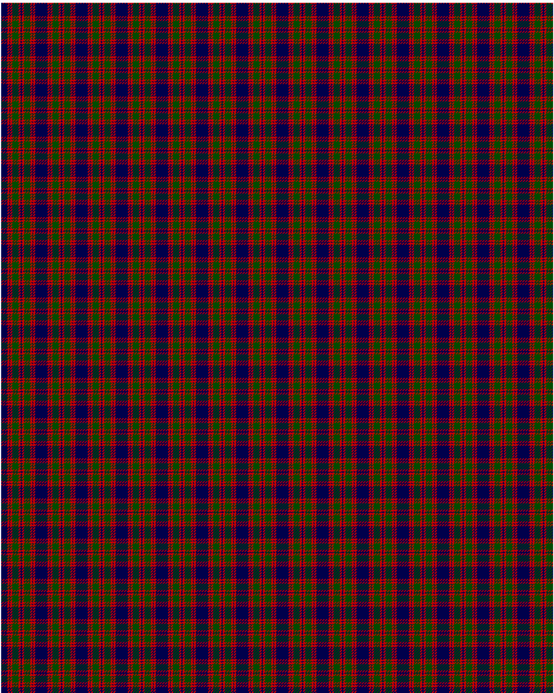

Skene

This was sourced from <no value>.  It is a 7 stripes tartan.

Original link http://www.weddslist.com/cgi-bin/tartans/pg.pl?source=rb

## Thread count
DB/9 R3 DB1 R3 G9 R3 DB/1

## Palette
DB#00004C G#004C00 R#C80000

# Sample pattern

ID: DB/9/R3/DB1/R3/G9/R3/DB/1-DB$00004C G$004C00 R$C80000