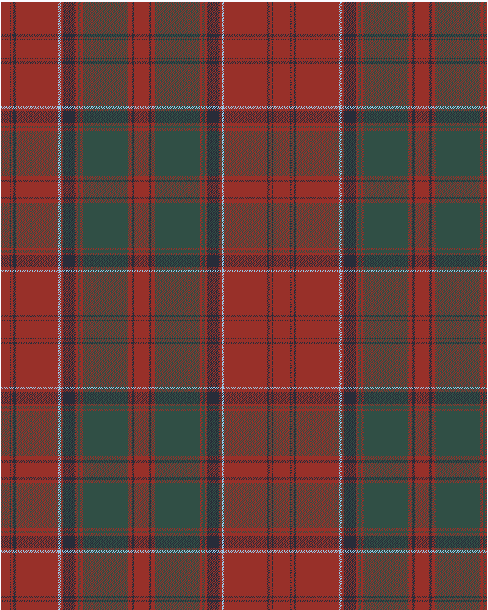

Drummond 2023 Kilt

This was sourced from <no value>.  It is a 15 stripes tartan.

Original link https://tartandictionary.org/posts/drummondsofmeggincholdkilt/

## Thread count
DR/14 DN2 DR4 DN4 DR70 LB4 DR4 DN20 DR4 N4 DR4 N74 DR6 DN4 DR/12

## Palette
DN#282C39 DR#983029 LB#98C8E8 N#304F45

# Sample pattern

ID: DR/14/DN2/DR4/DN4/DR70/LB4/DR4/DN20/DR4/N4/DR4/N74/DR6/DN4/DR/12-DN$282C39 DR$983029 LB$98C8E8 N$304F45