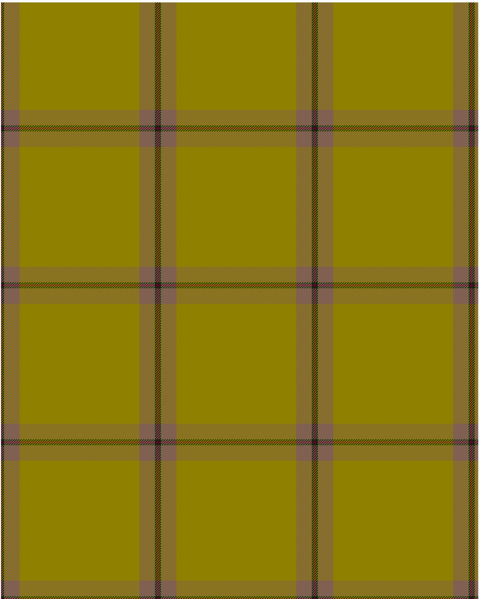

13, Irish Regiment

This was sourced from <no value>.  It is a 4 stripes tartan.

Original link http://www.weddslist.com/cgi-bin/tartans/pg.pl?source=sts

## Thread count
DR/2 DG3 LT26 LG/100

## Palette
DG#003000 DR#600030 LG#908000 LT#806050

# Sample pattern

ID: DR/2/DG3/LT26/LG/100-DG$003000 DR$600030 LG$908000 LT$806050