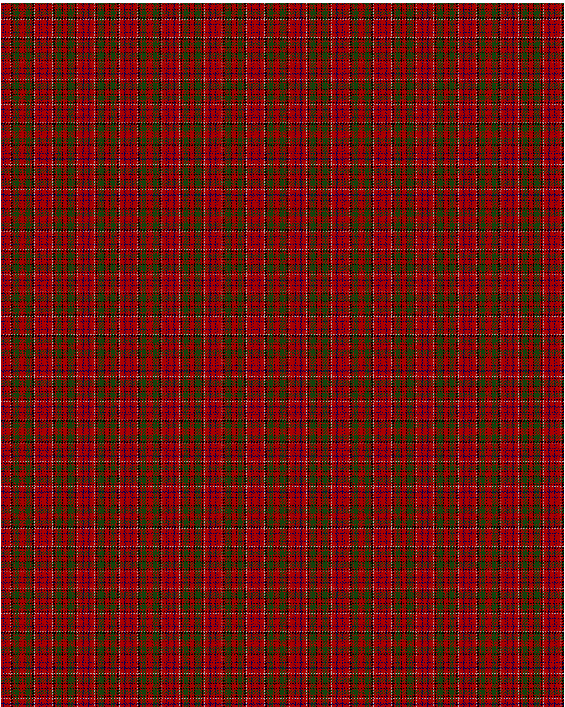

Drummond C

This was sourced from <no value>.  It is a 15 stripes tartan.

Original link http://www.weddslist.com/cgi-bin/tartans/pg.pl?source=x

## Thread count
DR/3 DB1 DR1 DB1 DR6 N1 DR1 K2 DR1 DG1 DR1 DG6 DR1 K1 DR/3

## Palette
DB#000052 DG#11450D DR#AA0000 K#000000 N#AAAAAA

# Sample pattern

ID: DR/3/DB1/DR1/DB1/DR6/N1/DR1/K2/DR1/DG1/DR1/DG6/DR1/K1/DR/3-DB$000052 DG$11450D DR$AA0000 K$000000 N$AAAAAA