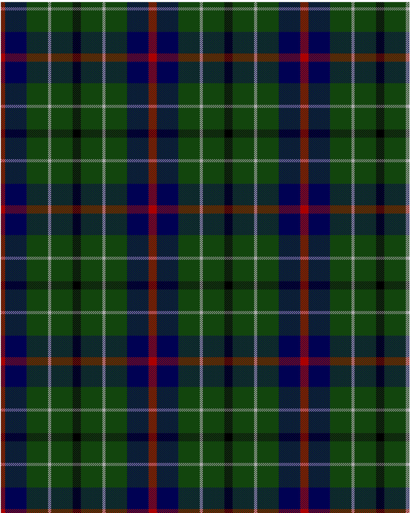

Duncan

This was sourced from <no value>.  It is a 6 stripes tartan.

Original link http://www.weddslist.com/cgi-bin/tartans/pg.pl?source=tinsel

## Thread count
DR/8 DB42 DG42 N6 DG42 K/8

## Palette
DB#000052 DG#11450D DR#AA0000 K#000000 N#AAAAAA

# Sample pattern

ID: DR/8/DB42/DG42/N6/DG42/K/8-DB$000052 DG$11450D DR$AA0000 K$000000 N$AAAAAA