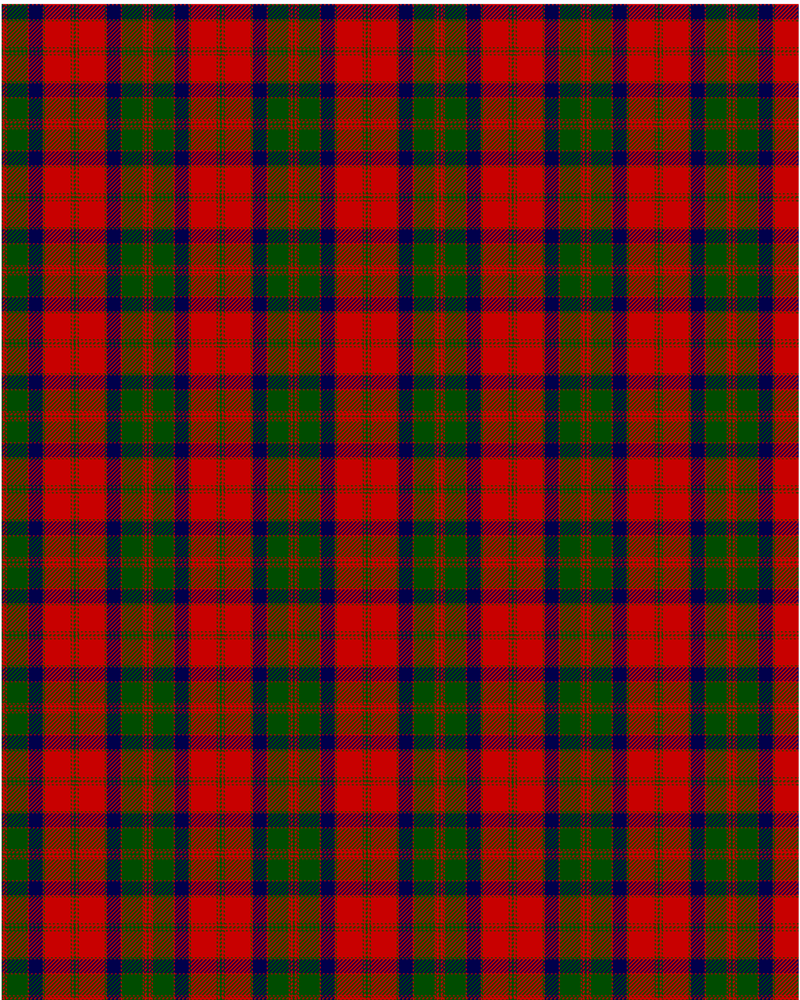

MacQuarrie 1815

This was sourced from <no value>.  It is a 13 stripes tartan.

Original link http://www.weddslist.com/cgi-bin/tartans/pg.pl?source=rb

## Thread count
G/1 R2 G1 R1 G21 R1 DB14 R1 G1 R26 G1 R2 G/1

## Palette
DB#00004C G#004C00 R#C80000

# Sample pattern

ID: G/1/R2/G1/R1/G21/R1/DB14/R1/G1/R26/G1/R2/G/1-DB$00004C G$004C00 R$C80000