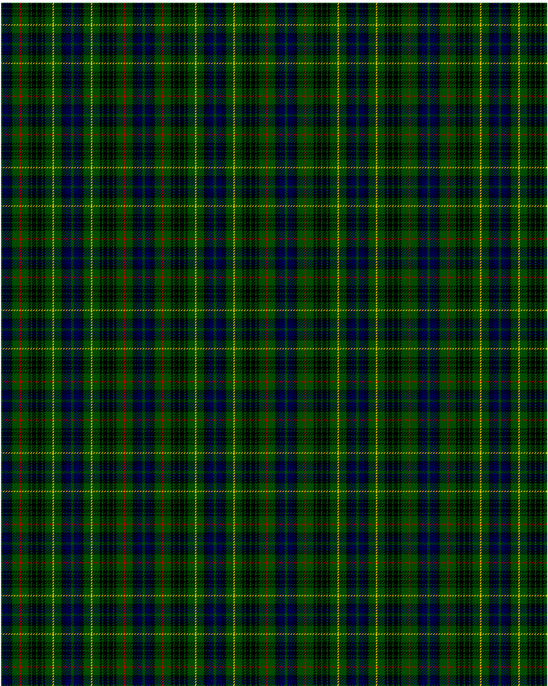

Stewart Hunting

This was sourced from <no value>.  It is a 27 stripes tartan.

Original link http://www.weddslist.com/cgi-bin/tartans/pg.pl?source=rb

## Thread count
G/2 DB8 K1 DB1 K1 DB1 K2 G11 R2 G11 K3 G2 K6 G2 K6 G2 K3 G11 Y2 G11 K2 DB1 K1 DB1 K1 DB8 G/2

## Palette
DB#00004C G#004C00 K#000000 R#C80000 Y#FFC800

# Sample pattern

ID: G/2/DB8/K1/DB1/K1/DB1/K2/G11/R2/G11/K3/G2/K6/G2/K6/G2/K3/G11/Y2/G11/K2/DB1/K1/DB1/K1/DB8/G/2-DB$00004C G$004C00 K$000000 R$C80000 Y$FFC800