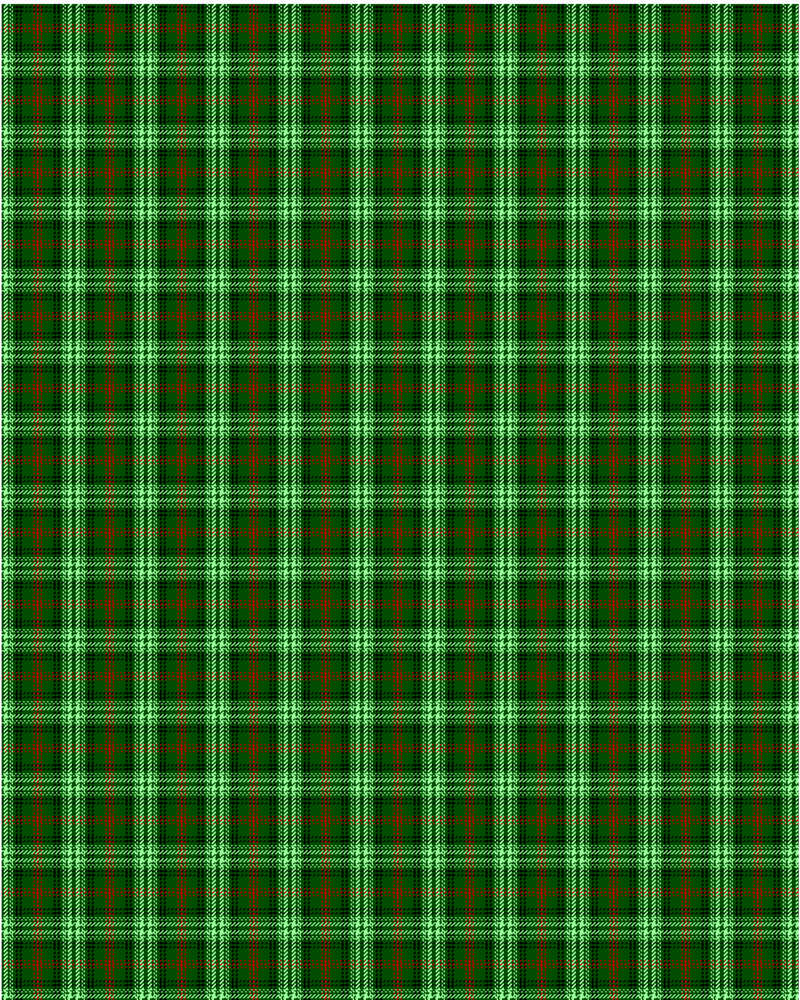

Ross Hunting

This was sourced from <no value>.  It is a 14 stripes tartan.

Original link http://www.weddslist.com/cgi-bin/tartans/pg.pl?source=rb

## Thread count
G/2 LG4 G2 LG1 G1 LG1 G3 K2 G2 K2 G12 R1 G2 R/1

## Palette
G#004C00 K#000000 LG#9AFF9A R#C80000

# Sample pattern

ID: G/2/LG4/G2/LG1/G1/LG1/G3/K2/G2/K2/G12/R1/G2/R/1-G$004C00 K$000000 LG$9AFF9A R$C80000