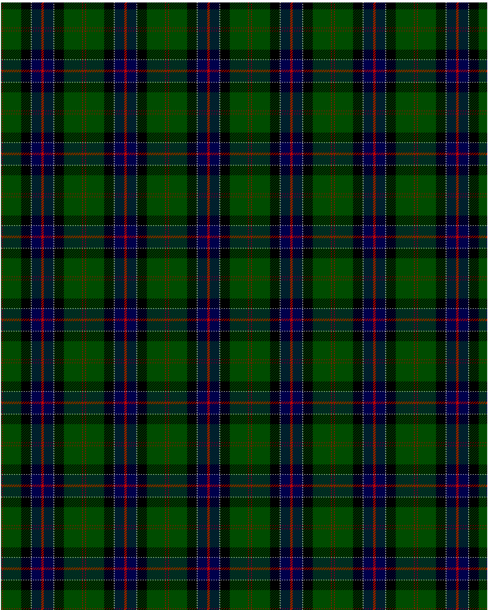

Sinclair Hunting

This was sourced from <no value>.  It is a 7 stripes tartan.

Original link http://www.weddslist.com/cgi-bin/tartans/pg.pl?source=rb

## Thread count
G/2 R1 G30 K16 N1 DB16 R/2

## Palette
DB#00004C G#004C00 K#000000 N#D0D0D0 R#C80000

# Sample pattern

ID: G/2/R1/G30/K16/N1/DB16/R/2-DB$00004C G$004C00 K$000000 N$D0D0D0 R$C80000