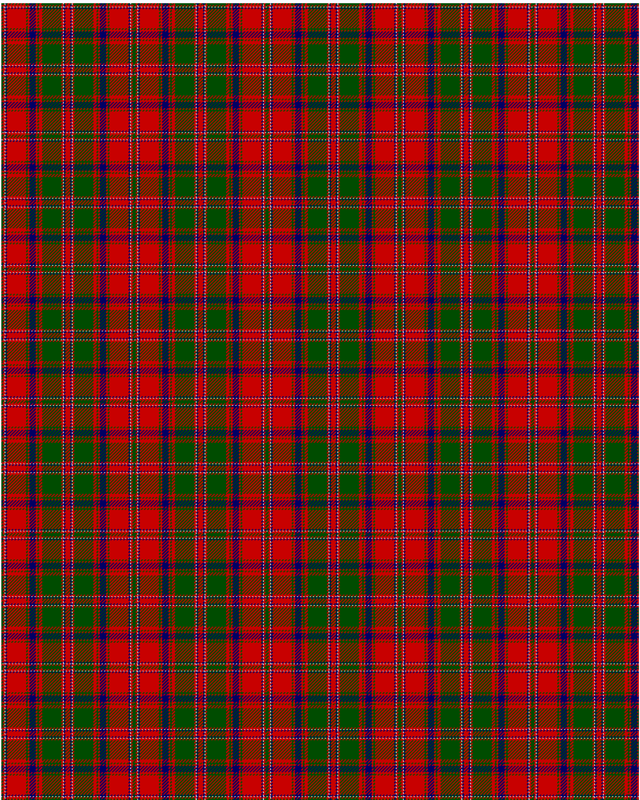

Stewart of Appin

This was sourced from <no value>.  It is a 16 stripes tartan.

Original link http://www.weddslist.com/cgi-bin/tartans/pg.pl?source=rb

## Thread count
G/2 R2 N1 DB2 R24 G2 R2 DB8 R2 G2 R4 G24 R2 N1 DB2 R/3

## Palette
DB#000064 G#004C00 N#D0D0D0 R#C80000

# Sample pattern

ID: G/2/R2/N1/DB2/R24/G2/R2/DB8/R2/G2/R4/G24/R2/N1/DB2/R/3-DB$000064 G$004C00 N$D0D0D0 R$C80000