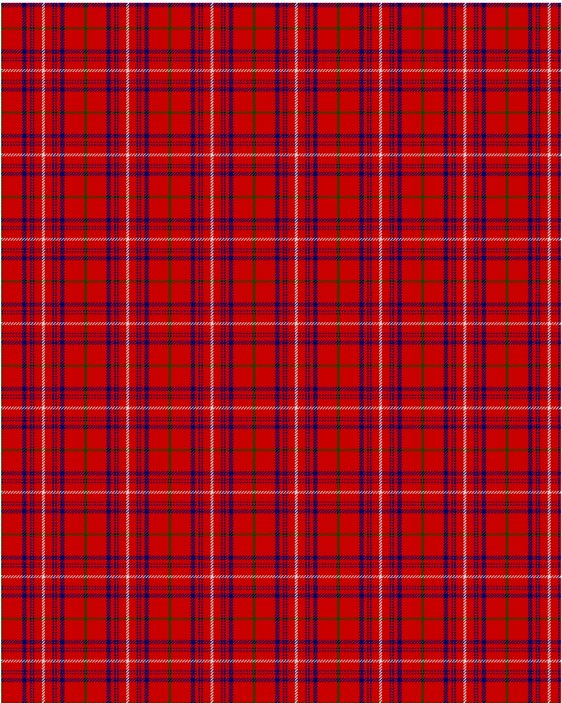

Rose

This was sourced from <no value>.  It is a 9 stripes tartan.

Original link http://www.weddslist.com/cgi-bin/tartans/pg.pl?source=rb

## Thread count
G/2 R28 DB6 R5 DB2 R2 DB2 R11 N/2

## Palette
DB#000064 G#004C00 N#D0D0D0 R#C80000

# Sample pattern

ID: G/2/R28/DB6/R5/DB2/R2/DB2/R11/N/2-DB$000064 G$004C00 N$D0D0D0 R$C80000