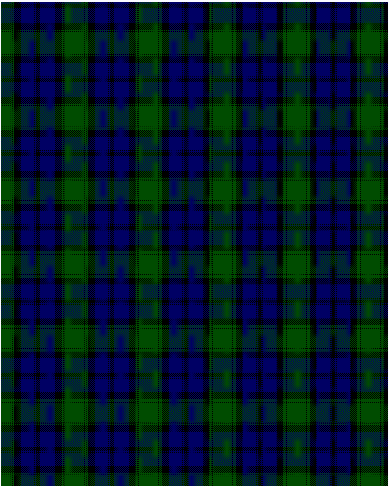

Kerr Hunting

This was sourced from <no value>.  It is a 10 stripes tartan.

Original link http://www.weddslist.com/cgi-bin/tartans/pg.pl?source=rb

## Thread count
G/20 K1 G2 K1 G3 K14 DB28 K1 DB2 K/4

## Palette
DB#000064 G#004C00 K#000000

# Sample pattern

ID: G/20/K1/G2/K1/G3/K14/DB28/K1/DB2/K/4-DB$000064 G$004C00 K$000000