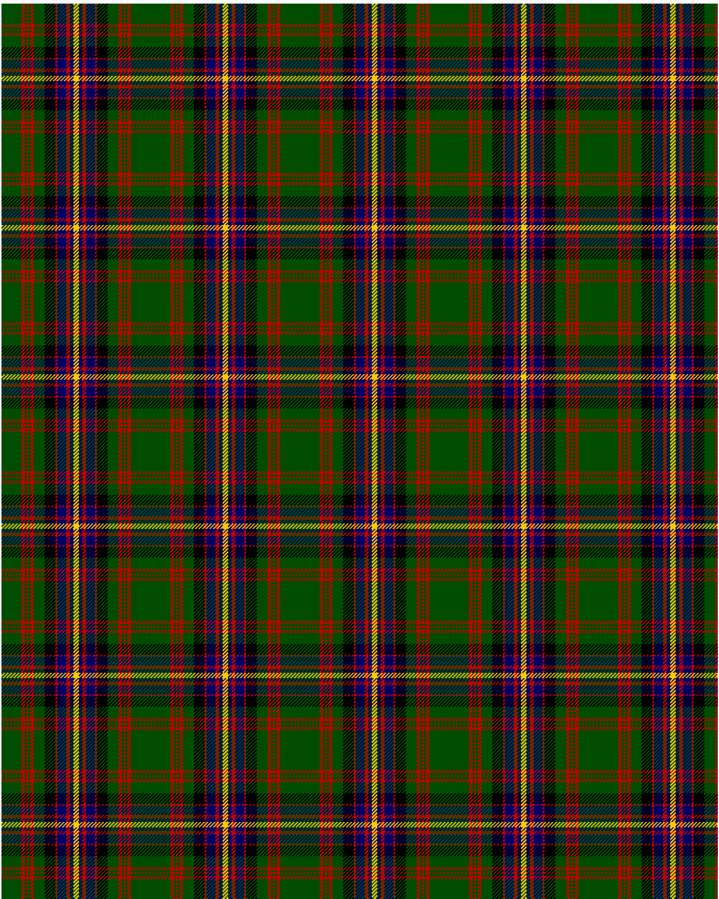

Cochrane LC

This was sourced from <no value>.  It is a 13 stripes tartan.

Original link http://www.weddslist.com/cgi-bin/tartans/pg.pl?source=rb

## Thread count
G/22 R4 G2 R2 G2 R4 G12 K12 R2 DB10 R4 DB4 Y/3

## Palette
DB#000064 G#004C00 K#000000 R#C80000 Y#FFC800

# Sample pattern

ID: G/22/R4/G2/R2/G2/R4/G12/K12/R2/DB10/R4/DB4/Y/3-DB$000064 G$004C00 K$000000 R$C80000 Y$FFC800