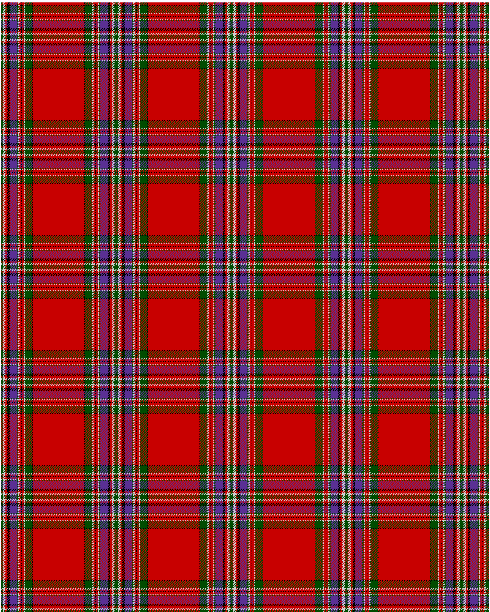

MacFarlane

This was sourced from <no value>.  It is a 14 stripes tartan.

Original link http://www.weddslist.com/cgi-bin/tartans/pg.pl?source=rb

## Thread count
G/3 N4 R3 K4 P12 G2 N2 R3 K1 R3 N2 G12 K1 R/42

## Palette
G#004C00 K#000000 N#D0D0D0 P#5A3094 R#C80000

# Sample pattern

ID: G/3/N4/R3/K4/P12/G2/N2/R3/K1/R3/N2/G12/K1/R/42-G$004C00 K$000000 N$D0D0D0 P$5A3094 R$C80000