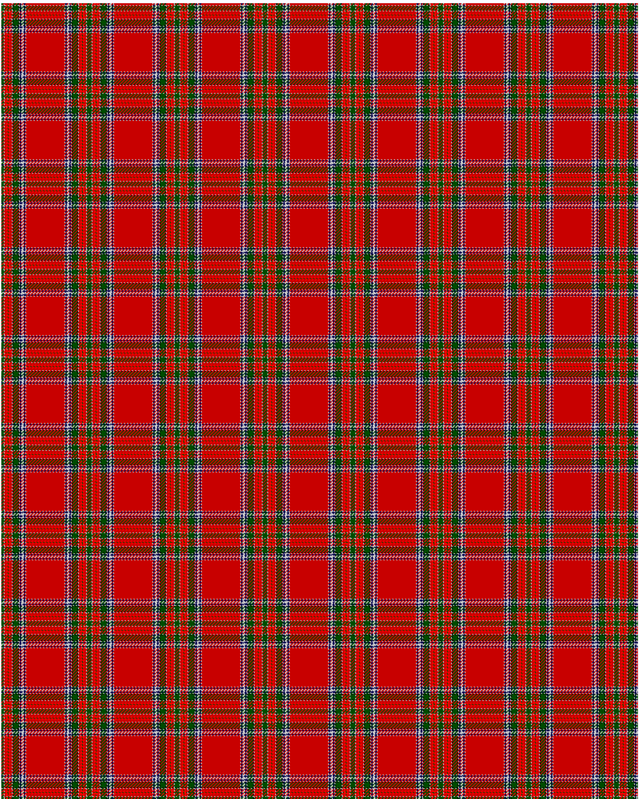

MacBean

This was sourced from <no value>.  It is a 19 stripes tartan.

Original link http://www.weddslist.com/cgi-bin/tartans/pg.pl?source=rb

## Thread count
G/3 NA1 R2 RA2 G1 RA2 R2 NA1 K1 G6 K1 NA1 DB2 N1 NA1 N1 DB2 NA1 R/24

## Palette
DB#00004C G#004C00 K#000000 N#D0D0D0 NA#C0C0C0 R#C80000 RA#FF0000

# Sample pattern

ID: G/3/NA1/R2/RA2/G1/RA2/R2/NA1/K1/G6/K1/NA1/DB2/N1/NA1/N1/DB2/NA1/R/24-DB$00004C G$004C00 K$000000 N$D0D0D0 NA$C0C0C0 R$C80000 RA$FF0000