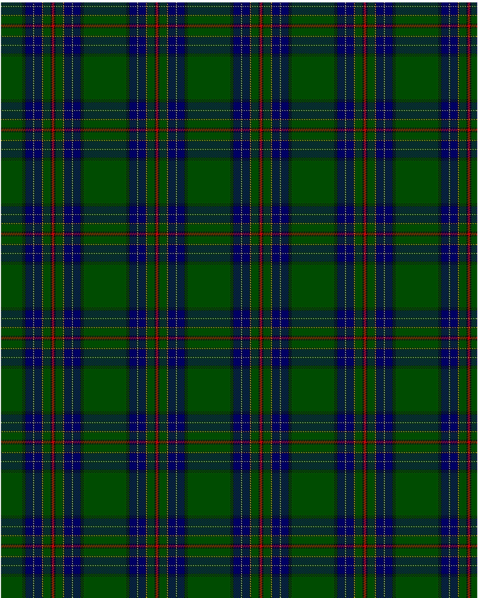

Cockburn

This was sourced from <no value>.  It is a 17 stripes tartan.

Original link http://www.weddslist.com/cgi-bin/tartans/pg.pl?source=rb

## Thread count
G/36 K1 G1 K1 G1 K1 DB12 K1 N1 K1 DB12 K1 Y1 K1 G12 K2 R/2

## Palette
DB#000064 G#004C00 K#000000 N#D0D0D0 R#C80000 Y#FFC800

# Sample pattern

ID: G/36/K1/G1/K1/G1/K1/DB12/K1/N1/K1/DB12/K1/Y1/K1/G12/K2/R/2-DB$000064 G$004C00 K$000000 N$D0D0D0 R$C80000 Y$FFC800