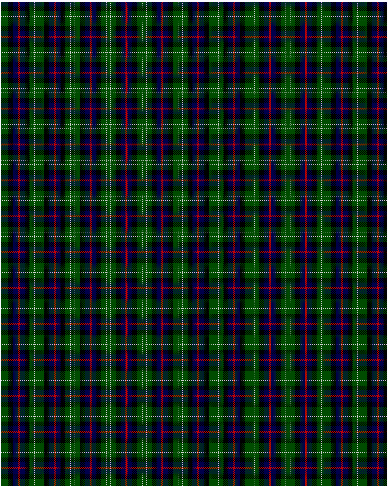

Rose Hunting

This was sourced from <no value>.  It is a 6 stripes tartan.

Original link http://www.weddslist.com/cgi-bin/tartans/pg.pl?source=rb

## Thread count
G/4 N1 G10 K10 DB10 R/2

## Palette
DB#00004C G#004C00 K#000000 N#D0D0D0 R#C80000

# Sample pattern

ID: G/4/N1/G10/K10/DB10/R/2-DB$00004C G$004C00 K$000000 N$D0D0D0 R$C80000