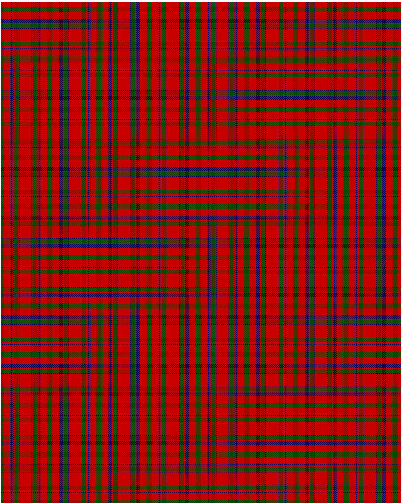

MacColl

This was sourced from <no value>.  It is a 14 stripes tartan.

Original link http://www.weddslist.com/cgi-bin/tartans/pg.pl?source=rb

## Thread count
G/4 R1 G1 R12 DB1 R1 DB3 R1 DB1 R2 G8 R1 DB1 R/12

## Palette
DB#000064 G#004C00 R#C80000

# Sample pattern

ID: G/4/R1/G1/R12/DB1/R1/DB3/R1/DB1/R2/G8/R1/DB1/R/12-DB$000064 G$004C00 R$C80000