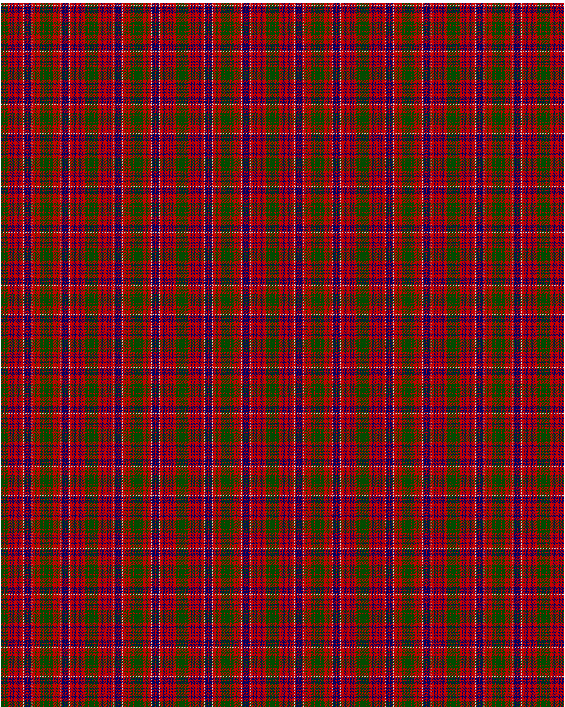

MacRae

This was sourced from <no value>.  It is a 31 stripes tartan.

Original link http://www.weddslist.com/cgi-bin/tartans/pg.pl?source=rb

## Thread count
G/4 R1 G4 R4 DB1 R1 DB1 R1 DB1 R4 DB1 R1 DB1 R1 DB1 R4 N1 R1 DB4 R1 DB4 R1 N1 R4 G1 R1 G1 R4 G4 R1 G/4

## Palette
DB#000064 G#004C00 N#D0D0D0 R#C80000

# Sample pattern

ID: G/4/R1/G4/R4/DB1/R1/DB1/R1/DB1/R4/DB1/R1/DB1/R1/DB1/R4/N1/R1/DB4/R1/DB4/R1/N1/R4/G1/R1/G1/R4/G4/R1/G/4-DB$000064 G$004C00 N$D0D0D0 R$C80000